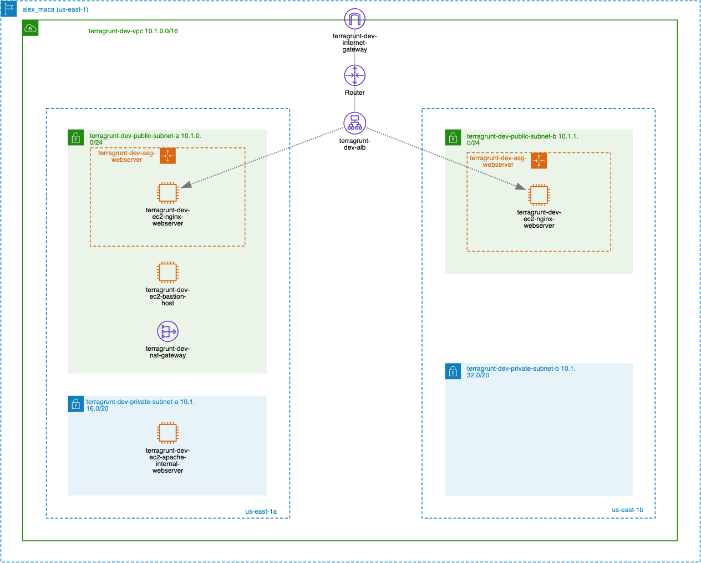

# Project Infrastructure:



# Project Structure:

<pre>
AWS-Core-Architecture/
├── root.hcl                  # ✅ Root config
├── a-autoscaling-infra/
│   ├── config-vars.yml       # ✅ includes "root"
│   └── terragrunt.hcl
├── a-networking-infra/
│   └── terragrunt.hcl        # ✅ includes "root"
├── common/
│   ├── common.hcl            # ✅ Common inputs, locals
│   └── common.yml            
├── modules/                  # ✅ Pure Terraform modules (no terragrunt here)
│   ├── autoscaling/
│   │   ├── user-data-scripts/
│   │   │   ├── bastion-host-ec2-user-data.sh
│   │   │   ├── internal-webserver-ec2-user-data.sh
│   │   │   └── nginx-webserver-ec2-user-data.sh
│   │   ├── autoscaling.tf
│   │   ├── data-sources.tf
│   │   ├── main.tf
│   │   ├── outputs.tf
│   │   └── variables.tf
│   └── networking/
│       ├── main.tf
│       ├── networking.tf
│       ├── outputs.tf
│       └── variables.tf
└── README.md
</pre>


# Issues encountered:

## 1. Generate provider or remote_state blocks in common.hcl
* Do not move provider or remote_state blocks to common.hcl as it doesn't support include context.
* When using read_terragrunt_config(), common.hcl is only read — it doesn't pass include context. So functions like path_relative_to_include() will return "." and state paths will break.
* generate only works if the file is included as part of the Terragrunt hierarchy (e.g., root.hcl), not just read with read_terragrunt_config().
* read_terragrunt_config() → only loads locals and inputs, but ignores generate, remote_state, and dependency blocks.

## 2. Expose attribute on include
* include "root" needs expose = true to share locals
* By default, locals defined in an included file are not exposed to the including file. If you want to expose them, you must set expose = true in the include block.
Error type given:
  [Partial] Included config ./root.hcl has strategy shallow merge: merging config in (shallow).
```
include "root" {
  path   = find_in_parent_folders("root.hcl")
  expose = true
}
```


# Structure should be:
* ansible
* terraform
* jenkins
* vars
* src
* resources